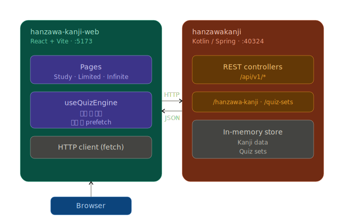

# hanzawa-kanji-web

> 외우지 못한 한자는 잊지 않습니다. **반드시 갚아드리죠. 배로.**

상용한자 2,136자를 훈·음 객관식 퀴즈로 반복 학습하는 웹앱의 프론트엔드입니다.

> 백엔드 API는 별도 저장소([`hanzawakanji`](#관련-저장소))에 있습니다.

## 시연

<!-- TODO: GIF 또는 영상 링크 -->

## 주요 기능

- **세 가지 학습 모드** (`/study`, `/limited`, `/infinite`)
  - `공부 모드` — 한자 카드 리스트를 훑어보는 모드
  - `유한 모드` — 정해진 문항 수만큼 풀고 결과 확인
  - `무한 모드` — 커서 기반 페이지네이션으로 끝없이 풀기
- **Zero-Loading UX** — 문제 풀이 중 로딩 스피너를 보지 않도록 설계
  - 보기 후보를 **200개 단위로 미리 로드**, **50문제마다 백그라운드에서 보충**
  - 무한 모드는 커서 기반 프리페치로 다음 문제를 끊김 없이 제공
- **가상 스크롤** — 한자 카드 리스트에 `react-window`를 사용해 대량 렌더링 비용 최소화
- **Mock 모드** — API 서버 없이 단독 실행 가능. `.env.local`에서 활성화합니다.
  ```env
  VITE_USE_MOCK=true
  ```

## 기술 스택


## 아키텍처



주요 훅은 [`src/shared/hooks/useQuizEngine.js`](src/shared/hooks/useQuizEngine.js)에 있으며, 모드 분기·보기 풀 보충·정답 판정을 모두 담당합니다.

## 실행 방법

### 요구사항

- Node.js 20+
- (선택) 백엔드 서버 — [`hanzawakanji`](#관련-저장소) 참고. Mock 모드로만 돌릴 거면 불필요.

### 개발 서버

```bash
npm install
npm run dev
```

### 환경 변수

프로젝트 루트에 `.env.local` 파일:

```env
# true: mock 데이터 사용 (API 서버 불필요)
# false: 실제 API 서버 호출
VITE_USE_MOCK=true
```

API 엔드포인트 base URL은 [`src/shared/constants/index.js`](src/shared/constants/index.js)의 `BASE_API`에서 관리합니다. 기본값 `http://localhost:40324/api/v1/hanzawa-kanji`.

### 빌드

```bash
npm run build
npm run preview
```

## 디렉터리 구조

```
src/
├── pages/           # 모드별 페이지 (Study / Limited / Infinite)
├── components/      # 카드·버튼·결과 요약 등 뷰 컴포넌트
├── shared/
│   ├── api/         # fetcher (mock / real 분기)
│   ├── hooks/       # useQuizEngine — 퀴즈 코어 로직
│   ├── constants/   # 튜닝 값 (보기 풀 사이즈, 리필 주기 등)
│   └── css/         # CSS Modules
└── utils/           # shuffle, queryHelpers 등
```

## 관련 저장소

- **API (Backend)**: `hanzawakanji` — Kotlin + Spring Boot
