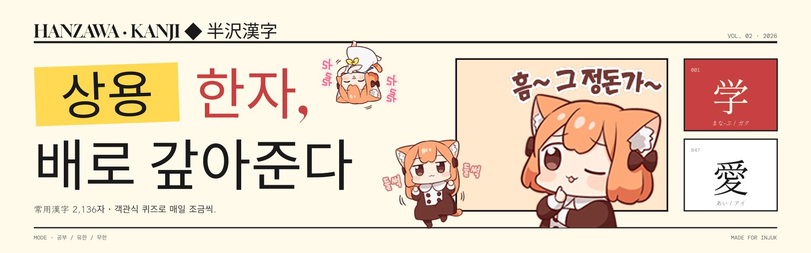

<div align="center">



<h1>
  
</h1>

<p>
  <b>외우지 못한 한자는 잊지 않습니다. 반드시 갚아드리죠. 배로.</b>
  <br />
  <sub>상용한자 2,136자를 훈·음 객관식 퀴즈로, 
  </br />
  — 반복 학습하는 웹앱의 프론트엔드</sub>
</p>

<br />

<p>
  <a href="#-시연"></a>
  <a href="#-실행-방법"></a>
  <a href="https://github.com/mindaaaa/hanzawa-kanji-api"></a>
</p>

<br />

<table align="center">
  <tr>
    <td align="center"><b>2,136</b><br/><sub>상용 한자</sub></td>
    <td align="center"><b>3</b><br/><sub>학습 모드</sub></td>
    <td align="center"><b>0ms</b><br/><sub>로딩 스피너</sub></td>
    <td align="center"><b>∞</b><br/><sub>무한 모드</sub></td>
  </tr>
</table>

</div>

<br />

---

## 📺 시연

<div align="center">

<!-- TODO: GIF 또는 영상 링크 -->


</div>

<br />

---

## 💻 주요 기능

<table>
<tr>
<td width="50%" valign="top">

### 세 가지 학습 모드

| 경로        | 모드         | 설명                      |
| ----------- | ------------ | ------------------------- |
| `/`         | **Home**     | 모드 선택 랜딩 페이지     |
| `/study`    | **Study**    | 상용한자 전체 카드 리스트 |
| `/limited`  | **Limited**  | 10·20·30문제 정해서 풀기  |
| `/infinite` | **Infinite** | 커서 기반 무한 풀이       |

</td>
<td width="50%" valign="top">

### Zero-Loading UX

문제 풀이 중 **로딩 스피너를 보지 않도록** 설계했습니다.

- 보기 후보를 **200개 단위 프리로드**
- **50문제마다** 백그라운드 보충
- 무한 모드는 **커서 기반 프리페치**로 끊김 없음

</td>
</tr>
<tr>
<td width="50%" valign="top">

### 가상 스크롤

한자 카드 리스트에 `react-window`를 사용해 <br /> **2,000+ 개의 카드**를 렌더링해도 60fps를 유지합니다.

</td>
<td width="50%" valign="top">

### Mock 모드

API 서버 없이 **단독 실행** 가능.

```env
VITE_USE_MOCK=true
```

</td>
</tr>
</table>

<br />

---

## 🛠️ 기술 스택

<div align="center">

### Core


### Styling & Performance


### Tooling


</div>

<br />

---

## 🏛️ 아키텍처

<div align="center">


</div>

> [!TIP]
> **핵심 훅**, [`useQuizEngine`](src/shared/hooks/useQuizEngine.js)이 <br />
> 모드 분기 · 보기 풀 보충 · 정답 판정을 모두 담당합니다.

<br />

---

## 🚀 실행 방법

### 요구사항

- **Node.js 20+**
- (선택) 백엔드 서버
  - [`hanzawakanji-api`](https://github.com/mindaaaa/hanzawa-kanji-api) 참고.
  - _Mock 모드로만 돌릴 거면 불필요._

### 개발 서버

```bash
npm install
npm run dev
```

### 환경 변수

프로젝트 루트에 `.env.local` 파일을 만드세요.

```env
# true: mock 데이터 사용 (API 서버 불필요)
# false: 실제 API 서버 호출
VITE_USE_MOCK=true
```

> [!TIP]
> API 엔드포인트 base URL은 [`src/shared/constants/index.js`](src/shared/constants/index.js)의 `BASE_API`에서 관리합니다.

### 빌드

```bash
npm run build
npm run preview
```

### Storybook

컴포넌트 단위로 격리된 뷰를 확인하거나 개발할 때 사용합니다.

```bash
npm run storybook        # http://localhost:6006
npm run build-storybook  # 정적 빌드
```

---

## 📂 디렉터리 구조

```
src/
├── pages/           # 라우트별 페이지 (Home / Study / Limited / Infinite)
├── components/      # 도메인 UI (Topbar, KanjiCard, QuestionCard, QuizMeta 등)
├── ui/              # 재사용 프리미티브 (Button, Card, Pill, Sticker, Warn)
├── styles/          # 전역 스타일 (fonts, tokens, global)
├── shared/
│   ├── api/            # fetcher (mock / real 분기)
│   ├── hooks/          # useQuizEngine — 퀴즈 코어 로직
│   └── constants/      # 튜닝 값 (보기 풀 사이즈, 리필 주기 등)
├── data/            # mock JSON (mockKanji, mockQuizData)
├── 🛠️ utils/           # shuffle, queryHelpers
├── App.jsx
└── main.jsx
```

---

## 🔗 관련 저장소

<div align="center">

<table>
<tr>
<td align="center" width="50%">

### Frontend (현재 저장소)

**React + Vite**
<br /><sub>상용한자 퀴즈 웹앱</sub>

</td>
<td align="center" width="50%">

### [Backend API](https://github.com/mindaaaa/hanzawa-kanji-api)

**Kotlin + Spring Boot**
<br /><sub>한자 데이터 & 퀴즈 서빙</sub>

</td>
</tr>
</table>

</div>

---

<div align="center">

<sub>
  倍返しだ！
  <br />
  <b>— 배로 갚아드리죠. —</b>
</sub>

</div>
